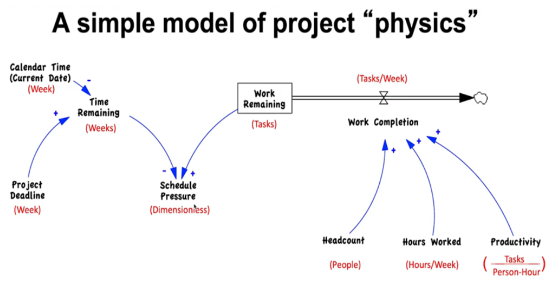

# System Dynamics Application: Managing Complex projects

## Using systems thinking

Now we're going to view the project management simulator as a system, applying systems thinking. Think of this a some phase of the project. Let's say that phase A was the design phase of the project.

