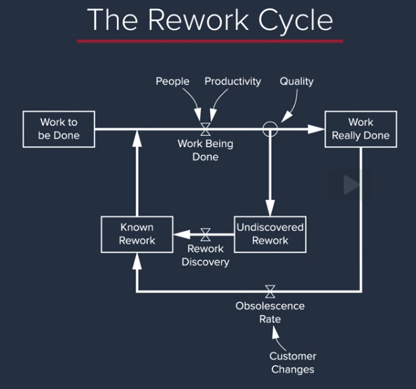

# System Dynamics Application: Managing Complex projects

## Using systems thinking

Now we're going to view the project management simulator as a system, applying systems thinking. Think of this a some phase of the project. Let's say that phase A was the design phase of the project.


In every phase:
- There is a certain amount of work remaining
    - tasks
    - code
    - maintenance
- There us a rate which work is completed
    - task/week
    - flow out of the remaining work
- The rate of completion depends on tree factors
    - headcount
    - hours worked
    - productivity (task/person-hour)
    ```
    Total work completion = headcount * hours worked * productivity
    (tasks/week)          = (people)  * (hous/week)  * (tasks/person-hour)
    ```
- There is schedule pressure
    - how much work need to be done, the rate of work completion, in order to hit the deadline given the work remaining compared to the time remaining in which to that work given the headcount and the productivity that you expect.
    - if the work remaining rises, schedule pressure rise
    - if time remaining rises, schedule pressure fall
    - polarities in the causal loop indicate how the variable at the head of the arrow will change based on a change in the variable at the tail of the arrow
- There is time remaining
    - the difference between the deadline for the project or that phase of the project and what date it is right now today.

### Feedback loop

Now, the question is what kinds of feedback relationships are created by the various actions that people take to get a project that's behind back on track?


- Schedule pressure (bold blue arrow)
    - Increases work hours

But what happens if we use overtime too much for too long?
- Fatigue (red arrows)
    - Tired people make more mistakes and have lower productivity
- Reinforced feedback loop
    - More `schedule pressure` lead to more `work hours`
    - More `work hours` create `fatigue` and reduces `productivity`
    - Less `productivity` reduces `work completion`
    - Less `work completion` increases the `schedule pressure` again
    - This is a vicious loop or a reinforced loop (big red 'R')
    - What that means is there's an unintended consequence of using overtime, especially if you use it too much and too long. And that unintended consequence undermines productivity and harms your progress and might actually lead to more schedule pressure.

Takeaways:
- Always name feedback loops

## Adding errors to our model

Now the model have two flows after the work is completed. We recognize that some work has been done correctly and is actually completed, and some work has been done incorrectly and flow to a `undiscovered rework` bucket.


- Is undiscovered because we don't know yet that we made an error. It need to be discovered through testing and quality insurance.
- The sum of `work actually completed` and `undiscoovered work` is the work we believe is done
- More `Error fraction` result in less work done correctly and more undiscovered work
- By the model undiscovered work can be discovered by only by a testing process

### Feedback loop


- From the past example, `schedule pressure` increases `workweek` that increases `fatigue`
- `Fatigue` increases the `error fraction`
- `Error fraction` increases the amount of `undiscovered work`
- `Error discovery` goes up and increases `work remaining`
- And again the loop return to more schedule `pressure`
- This is the `Too tired to think straight` reinforced feedback loop

We can think in a few more actions that increase error in this model.
- Instead of only increase the workweek, we can cut corners, leave testing, documentation and even some nonessential parts behind.
    - Haste make waste reinforced feedback loop
- A big amount of accumulated undiscovered rework will increase the error fraction even further
    - Shifting foundations reinforced feedback loop
    - The delivery is being done but incorrectly
- Cut the testing phase
    - Three Monkeys reinforced feedback loop
    - Hear no evil, speak no evil, see no evil, the amount of work will pile up


### Real World Pressures

- Schedule pressure
- Management pressuring
- Shorten the time to develop the product
- Not increasing budget
- Not giving training
- Etc

> The technology may not be ready before alpha phase. Sometimes we have no choice, we just have to put something in.

> Often, we'll put [early prototype] parts in a [later prototype]... There's no getting around it, as long as we have to go fast.

> We might be able to finish the part, finis the FMEA's (Failure Modes Effects Analysis), etc. We'll do the FMEA's, but we won't be as thorough as they would [be] otherwise.

> We haven't done the FMEA yet. We just don't have the time to do it.

How the project come in on time and under a budget? We:
- Cut corners
- Weren't careful
- Made a lot of errors
- Didn't report any of those errors
- Passed them off to the next phase
- Didn't do any testing
- Didn't do any training
- Didn't document the work
- Didn't train and mentor anybody
- Didn't coordinate with any of the other parts of our organization

The problem is that nobody say that. Instead, you know that you're doing these things, but you cover them up. This is the `LIAR'S CLUB`. Concealing know rework requirements from managers and colleagues.

There is this cultural commandment that contributes for this situation. It is not only wrong but introduces extra delay in the discovery of the rework.
> There is a basic cultural commandment in engineering - don't tell someone you have a problem unless you have the solution. You're supposed to solve it - and then tell them - Senior Engineer

Another wrong cultural behavior observed is the `SELF-CONFIRMING ATTRIBUTION ERROR`. First, people learn never to reveal problems because they're going to get yelled at if they do. Secondly, bosses learn that it's only by yelling at people that you're going to get people to start buckling down and solving their problems.

> Nobody ever gets credit for fixing problems that never happened - Senior Engineer

Takeaways:
- Blaming employees often leads to workers' tendency to conceal problems and managers overestimate the impact of their get-tough policy. This is an example of a self-confirming attribution error.
- It is faster and cheaper to correct problems when rework is discovered earlier, rather than later.
- System dynamics can be used to validate behavior in project organizations, such as whether management intervention leads to improvements in performances.

### Lessons Learned

- When should you hire for your project?  
Hire upfront. Start with more people than the plan.

- When should you use overtime?
Sparingly, and only at the end of a project. Limit it.

- When should you cut corner?
Never.

- When you should cut testing?
Never.

You avoid situation of pressure and fail in delivering a project by making sure you've got ample resources and emphasizing quality throughout. `Stop the project because people aren't doing the right thing. Don't stop the project because people are not hitting their deadlines`.

The result in not doing these things is of course rework.

Example of a system dynamic model of a large-scale projects.



- There is work to be done
- Some of this work is made incorrectly, that leads to undiscovered rework
- When this is discovered by testing, it enters a pool of know rework

And late customer changes make some of the work that you have done correctly obsolete, further increasing the known rework and the schedule pressure. And there is a huge network of feedbacks around these flows, and they tend to have the characteristic that once a project starts to fail, these reinforcing feedback loops act as vicious cycles that further amplify the distress.


