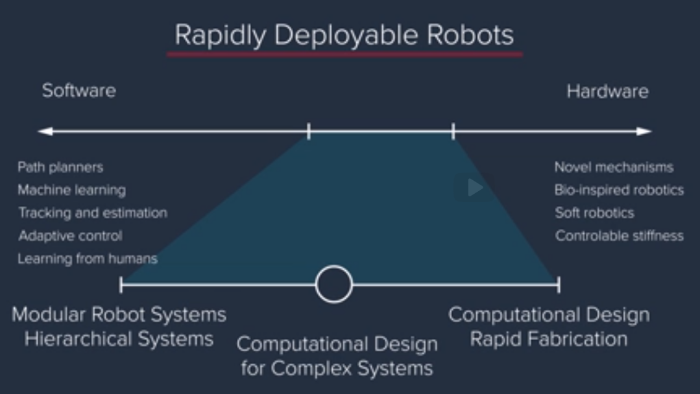

# Supply Chain and Computational Approaches to Systems Thinking

Different performance

- The performance of a system depends on its entities, their relationships, our knowledge of the system, and our ability to regulate it
- The performance of systems can vary because of differences in: the systems’ form; the systems’ entities; the entities’ connectivity; the scale; the control of the entities; the knowledge of the system; or the behavior of the operands.
- The performance of a system is defined by how well it conducts its functions.
- Systems thinking can be applied to systems of movements, such as supply chains, transportation networks, and information networks.
- Systems that perform the exact same function may have different performances, this might be explained by:
    - The entities of the systems are different
    - The scales are different
    - The connectivity between the systems entities are different
    - ** Our ability to control the different entities is different
    - ** Our Knowledge of the systems is different
    - ** The behavior of the operands is different
    - The form of both systems are different

## Three Scenarios

-First
    - We know everything about the system
        - How the individual entities behave
        - How the entities relate to each other
        - Ability to regulate operand and entity behavior

In this scenario we can get a very high level of performance through optimization. Eg: the Chinese train system.

- Second
    - We know some things about the system
        - Less ability to regulate system

This is a more common scenario. Eg: a road. In this case, we can get better performance through `policies`. For example, we can set up the rules of the road, we can time the traffic signals, and so on to get improvements in performance.

- Third
    - We know very little about the system
        - Operand ac in own self-interest

We may know just the connectivity between the entities and the operands may be acting in their own self-interest. In these cases, we will need to introduce incentives or provide information or feedback in order to improve the performance of the system. Imagine a road network with no traffic lights that we can find. In this case, we can still get improvement in performance through providing information on congestion or through metering access to that stretch of road network itself though a GPS mobile app.

And this sort of behavior, this paradox called Braess's Paradox, is a sign of what's called the Price of Anarchy. When everybody acting in their own self-interest and doing what is best for them, in fact leads to the system as a whole, the performance of the system as a whole, degrading and becoming worse.

The Price of Anarchy is a concept in economics and game theory in which the `performance` of a system `degrades` due to its agents (operands) acting in their `own self interest` and doing what’s best for them (selfish behavior).

## Queue Systems and Networks

Queue
To do: See Little's Law, apply to Data Squad services.
- Little’s law is a powerful way of sizing what’s happening in the system with almost no assumptions.
- Little’s law assumes a steady state assumption, i.e. no transients, ramp up or ramp down.

Cascading Failure
In particular, the propagation of disturbances is a challenge when you have these large scale networks where things are no longer self-contained. A problem or a failure is no longer restricted to the one node or the one component in which the failure occurs but instead can now spread to the entire system. So cascading failures can be an important aspect of an emergent property of network systems.
- Cascading Failures are an emergent property of network systems
- One might attempt to predict cascading failures via precedent, experimentation, modelling, or human reasoning.

The Bullwhip Effect
- A false idea of demand or low performance in some entity could lead to the decision adding resources or even change other entities.
- Better information sharing upstream is one of the ways to avoid the bullwhip effect
- In the bullwhip effect, all entities are functioning as they should - but the desired emergence does not occur. This is an example of a true system failure.
- Better information sharing (e.g. by knowing actual customer demand at the point of sale) can counter the trade-off between uncertainty and efficiency of the system.
- Improving the ability to regulate the system can improve the efficiency of the system, leading to reduced trade-offs being required between efficiency and uncertainty.
- The bullwhip effect is an undesirable emergent behavior that can occur from a system, but not all fluctuations will necessarily lead to large effects, especially in a systems with a high degree of information sharing.

The bullwhip effect is a result of `trade-off` between `uncertainty` and the `efficiency` of the system. Improving information sharing and the ability to regulate the system can mitigate the bullwhip effect

Modern Logistics and Transportation Systems
- Modern technologies such as artificial intelligence (AI) and machine learning (ML) enable us to go from data to models to decision and insights
- We should be mindful about trade-offs between efficiency obtained from sharing information and security and privacy concerns

## The Computational Approach to System Thinking

- A system is an entity with interrelated and interdependent parts. It is defined by its modules, by the boundaries between the modules, and by their interaction
- Computational systems thinking design process: database -> choose modules -> compose modules -> simulate and verify -> fabricate

The robot compiler.  
A compiler takes a high-level specification and delivers a working system. And in this case, the user could conceive an idea.

Design Process
- Database of parts
- Interactive modeling
- Rapid prototyping technology

Rapidly creating systems that have complex functionality involves a software component and a hardware component.

- Each of the specific capabilities on the software and the hardware side can be package abstracted out and databased
- The idea of doing computational design for complex systems fits in-between modular hierarchical machines and computational design and fabrication.
- The challenges to implementing this idea have to do with creating the actual database of components because the approach is data-driven.
    - `Data Driven Approach`
        - Relies on a database that is seeded with low level designs, and some higher level designs created by experts.
- Computational approach to systems thinking is data driven. Data driven approach relies on a database that is seeded with low level designs, and some higher level designs created by experts

Once we have the database we need a process.
- Database
- Choose modules
- Compose modules
- Simulate modules
- Simulate and Verify
- Fabricate

### The Database
- The entities in a database are mechanical parts, electromechanical parts and software components
- All database components have to be parametrized in order to have large representation and scalability from each existing component
- The components need to be defined in a hierarchy way
- We need to know how the components interact physically with one another
- Also we need to know hot the components interact functionally with one another, what degrees of freedom do we allow at the connection
- Every component should be parametrized
- Every component also should have constraints, functional or requirements
- The challenges to implementing this idea
have to do with creating the actual database of components
because the approach is data-driven.

Next steps are about: composing the modules, Simulate, Verify, and Fabricate.

- Computational approach to systems thinking is enabled by 3 important concepts: data driven specification, hierarchical composition, and simulation and verification.

